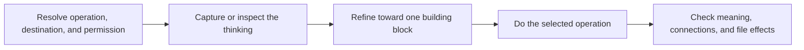

# PTLam Creating Atomic Notes

Build durable notes from an idea, a source, or an existing note. Each note holds
one useful building block of knowledge. This skill owns meaning, growth, and
connections. The user's note system owns storage, metadata, and links.

## How does one idea become a durable building block?

| Operation | Result                                                          | Default file effect     |
| --------- | --------------------------------------------------------------- | ----------------------- |
| Create    | One complete draft per independent building block               | Return Markdown drafts  |
| Mature    | A work-in-progress note moved to an explicit next stage         | Return a Markdown draft |
| Review    | A verdict with evidence and the smallest corrections            | Read-only               |
| Split     | Self-contained drafts with distinct purposes and connections    | Return Markdown drafts  |
| Merge     | One draft that keeps unique evidence, sources, and link context | Return a Markdown draft |

Change files only when the user explicitly asks. Deleting, archiving,
redirecting, and rewriting backlinks are separate effects that need their own
permission.

## 1. Resolve the request and destination

Name the operation, the input, the output, and the note's role. The input may be
an idea, a source, a quote, a highlight, a rough capture, a work in progress, or
an existing note.

When the user names a vault, folder, or target file, inspect only the nearby
notes and configuration needed to learn its conventions. Follow the verified
local rules for filenames, front matter, headings, tags, links, and citations.
Keep the permission for each destination and file effect explicit.

Ask only when a missing choice would change the knowledge captured or its
destination. Otherwise make reversible presentation choices and continue. Return
Markdown in the reply unless the user asked for file changes.

Done when the operation, input, output, destination, local conventions, and
permission are known.

## 2. Settle the note's role and maturity

| Role             | Purpose                                            | Treatment                                                         |
| ---------------- | -------------------------------------------------- | ----------------------------------------------------------------- |
| Fleeting capture | Keep thinking before it disappears                 | Keep it provisional and make the next step obvious                |
| Literature note  | Record what a source contributes                   | Paraphrase faithfully and keep the source context                 |
| Permanent note   | Add a reusable building block to the network       | Make it understandable alone and connected on purpose             |
| Structure note   | Give access to an area or act as a thinking canvas | Keep one navigational purpose instead of forcing one content atom |

Unless the user asks otherwise, treat an atomic-note request as a draft
permanent note. "Permanent" means built for durable reuse, not frozen. Accept an
unfinished note when its state and next step are clear; atomicity is a direction
of growth, not an entry test.

Done when the note's role, maturity, and next state are explicit.

## 3. Refine toward one building block

Read [the atomicity model](references/atomicity-model.md) before judging or
rewriting content. It owns the definition, the building-block types, the focus
tests, the growth stages, and how much effort an idea deserves.

For a new idea, capture the thought freely before editing it. For supplied
content, keep the user's idea, the source wording, evidence, examples, and
neighboring claims apart.

Apply the model in two passes: first clarify (use the naming, removal, and
forward-motion tests to expose unclear, incomplete, or mixed ideas), then
identify (classify the building block, then use completeness and independent
reuse to decide which context stays).

Keep the focus narrow and the background as large as future understanding needs.
Keep attribution separate from the paraphrased idea. Quote exactly only when the
wording matters, then mark it, attribute it, and explain its relevance in fresh
words.

Done when the focal building block is identifiable, the kept context serves it,
the source status is clear, and the effort matches the idea's value.

## 4. Do the selected operation

Read [note operations](references/note-operations.md) and follow only the
selected section. It owns the create, mature, review, split, and merge actions,
their fallback output shapes, and their completion rules.

Search the note collection before claiming a link target exists. Use verified
local link syntax only for verified targets. Say why each relationship matters.
With no collection available, use `Suggested connections`, keep targets as plain
titles, and do not imply they are real files.

Done when the operation's result exists and every source, connection,
destination, and requested file effect has an explicit disposition.

## 5. Check and hand off

| Check        | The note must                                                                            |
| ------------ | ---------------------------------------------------------------------------------------- |
| Focus        | Hold one focal building block, or one declared navigational purpose                      |
| Context      | Carry the context the focus needs, and no independently useful neighboring block         |
| Standalone   | Make sense without the chat or the source                                                |
| Attribution  | Separate source claims, the user's interpretation, and established fact where it matters |
| Links        | Explain why each link matters, in verified local syntax                                  |
| Honesty      | Mark suggested connections apart from verified existing notes                            |
| Maturity     | Show its current state and next step while unfinished                                    |
| Conventions  | Keep local storage and metadata conventions                                              |
| File effects | Account for every allowed file effect                                                    |

For a review, name each failed check and its evidence. For changed files, report
what changed, where, how it was checked, and what is still open.

Finish when the output passes these checks, or the review names each failure
with a concrete fix.
