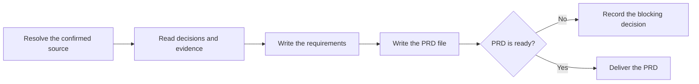

# PTLam Creating Product Requirements

Turn one confirmed grilling record or product brief into one product
requirements document (PRD) for the people who will specify and prioritize the
product. The PRD owns product framing. It does not own solution mechanics,
feature contracts, tickets, or implementation.

## Required skills

### `ptlam-explaining`

**Reason:** Makes unfamiliar product framing understandable to the document's reader without changing confirmed decisions.

**Instructions:** Read and apply ptlam-explaining before drafting the document.
Infer the reader's difficulty from the confirmed source and project
evidence; do not start another interview.
Let it own the literal model, explanatory structure, teaching order,
and reconstruction check.
Use its explanation package inside the document without changing
facts, scope, schema, destination, or readiness owned by this skill.
Enter the analogy branch only when the user explicitly asked for one.

Read [ptlam-explaining](skills/ptlam-explaining/SKILL.md).

### `ptlam-mermaiding`

**Reason:** Turns material product relationships into verified visuals that make the document faster to scan.

**Instructions:** Read ptlam-mermaiding before choosing the document's visual form.
Apply it to material sequences, hierarchies, states, dependencies, or
interactions; use a table for exact mappings.
Let it own the visual question, diagram type, Mermaid source, and the
strongest available syntax and rendering check.
Keep this skill's ownership of product facts, document structure,
visual placement, destination, and readiness.
Make each visual replace equivalent prose rather than repeat it.

Read [ptlam-mermaiding](skills/ptlam-mermaiding/SKILL.md).

## How does confirmed product intent become a PRD?

This skill does not interview. It writes from its confirmed source and never
re-asks a settled question. When an unknown would change the outcome, send it
back to decision work instead of choosing quietly.

## 1. Resolve the source and destination

Use this stage for a new product or a large epic. A feature inside an existing
product starts at the feature specification. A small fix skips this pipeline.

Read the applicable `AGENTS.md` files before choosing paths. Use their PRD
location when defined; otherwise write to `<project-root>/docs/prd/<slug>.md`.

Running this skill allows creating that one file and its missing parent folders.
It does not allow overwriting an existing PRD, changing the source evidence,
creating specs or tickets, changing code, or Git operations. Update an existing
PRD only when the user asked for that.

Done when the product, confirmed source, project root, destination, and write
permission are explicit.

## 2. Read the confirmed evidence

Use a complete grilling record when one applies. It must have status `complete`
and explicit user confirmation. When the record is still active, deferred,
blocked, or waiting for confirmation, stop and name the exact missing decision.

A confirmed product brief may replace the record when it meets the same bar:
explicit user confirmation, named evidence, and no hidden outcome-changing
question. Record the brief's path and why no grilling record applies.

Read only the repository and market evidence the source names. Keep verified
facts, user decisions, assumptions, risks, and rejected branches apart. Do no
fresh discovery and add no uncited claim.

Done when every product claim traces to a confirmed decision or named evidence
and no outcome-changing question is hidden.

## 3. Write the requirements

State who has which problem, why it matters now, which outcomes define success,
and what the product will and will not cover. Give outcomes and scope items
stable IDs so later specs can cite them.

Keep this boundary:

- the PRD carries audience, problem, evidence, outcomes, success measures,
  scope, non-goals, constraints, assumptions, and risks;
- the PRD carries the numbered constraints from the schema's table as product
  facts;
- the PRD carries no modules, schemas, API shapes, storage choices, or other
  solution mechanics; and
- the grilling record stays a decision map, not a draft PRD.

Done when a reader can decide whether a proposed feature serves the product
without knowing how it will be built.

## 4. Write the PRD file

Read
[the product requirements schema](references/product-requirements-schema.md). It
owns the file shape, stable IDs, status rules, and readiness checks.

When a missing decision changes audience, outcomes, scope, non-goals, or success
measures, save the PRD with status `blocked` and name the owner and the
consequence. Do not ask a replacement question.

Done when the destination holds one self-contained PRD and every schema section
has an explicit disposition.

## 5. Verify and deliver

Check every claim and source reference. Confirm the explanation keeps the
confirmed meaning and each visual replaces prose rather than repeating it.

Report the file, status, source, checks performed, and any blocking decision. A
PRD is ready for feature specification only with status `ready` and every
readiness check passing.

Finish when the file matches the confirmed source and is either ready or blocked
with the exact missing decision named.
