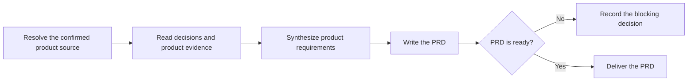

# PTLam Creating Product Requirements

Turn one confirmed grilling record or durable product brief into one product
requirements document (PRD) for the people who will specify and prioritize the
product. The PRD owns product framing; it does not own solution mechanics,
feature contracts, ticket slices, or implementation.

## Required skills

### `ptlam-explaining`

**Reason:** Makes unfamiliar product framing reconstructable for the document's reader without changing confirmed product decisions.

**Instructions:** Read and apply ptlam-explaining before drafting the PRD.
Infer the reader's likely difficulty from the confirmed source and
project evidence; do not start another interview.
Let it own the literal model, explanatory structure, teaching order,
and reconstruction check for unfamiliar or complex content.
Use its explanation package inside the PRD without changing facts,
scope, schema, destination, or readiness owned by this skill.
Enter the analogy branch only when the user explicitly requested it.

Read [ptlam-explaining](skills/ptlam-explaining/SKILL.md).

### `ptlam-mermaiding`

**Reason:** Turns material product relationships into verified visuals that make the PRD faster to scan and understand.

**Instructions:** Read ptlam-mermaiding before choosing the PRD's visual form.
Apply it to material sequences, hierarchies, states, dependencies,
interactions, or other relationships; use a table for exact mappings
or comparisons.
Let it own the visual question, diagram type, Mermaid source, and the
strongest available syntax and rendering verification.
Keep this skill's ownership of product facts, document structure,
visual placement, destination, and readiness.
Make each visual replace equivalent prose rather than repeat it.

Read [ptlam-mermaiding](skills/ptlam-mermaiding/SKILL.md).

## How does confirmed product intent become a durable PRD?

Only `ptlam-grilling` interviews. This skill synthesizes its confirmed source
and never re-asks a settled question. Route an outcome-changing unknown back to
decision work instead of choosing silently.

## 1. Resolve the source and destination

Use this stage for a new product or large epic. Start a feature inside an
existing product at the feature specification, and skip the pipeline for a small
fix.

Read applicable `AGENTS.md` files before resolving paths. Use their PRD location
when defined; otherwise write to `<project-root>/docs/prd/<slug>.md`.

Invocation authorizes creating that one file and missing parent directories. It
does not authorize overwriting an existing PRD, changing the source evidence,
creating specs or tickets, changing code, or performing Git operations. Update
an existing PRD only when the user requested that effect.

Complete this step when the product, confirmed source, project root,
destination, and file authority are explicit.

## 2. Read the confirmed evidence

Use a complete grilling record when one applies. Require status `complete` and
explicit user confirmation. When the record remains active, deferred, blocked,
or confirmation-pending, stop with the exact missing decision instead of
drafting around it.

A confirmed durable product brief may replace a grilling record when it carries
the same evidence bar: explicit user confirmation, named evidence, and no hidden
outcome-changing product question. Record the brief's path and why no grilling
record applies.

Read repository and market evidence already named by the source. Keep verified
facts, user-owned decisions, assumptions, risks, and rejected branches distinct.
Do not conduct fresh discovery or introduce uncited claims.

Complete this step when every product claim traces to confirmed decisions or
named evidence and no outcome-changing product question remains hidden.

## 3. Synthesize the product requirements

State who has which problem, why it matters now, which outcomes define success,
and what the product will and will not cover. Assign stable IDs to outcomes and
scope items so later specs can cite them without copying the PRD.

Keep this boundary explicit in the artifact:

- the PRD carries product audience, problem, evidence, outcomes, success
  measures, scope, non-goals, constraints, assumptions, and risks;
- the PRD carries no modules, schemas, API shapes, storage choices, or other
  solution mechanics; and
- the grilling record remains a decision map, not a draft PRD.

Complete this step when a reader can decide whether a proposed feature serves
the product without learning how that feature will be built.

## 4. Write the PRD

Read
[the product requirements schema](references/product-requirements-schema.md). It
owns the file shape, stable IDs, status rules, and readiness checks.

When a missing decision changes audience, outcome, scope, non-goals, or success
measures, persist the PRD with status `blocked` and name the owner and
consequence. Do not ask a replacement interview question.

Complete this step when the destination contains one self-contained PRD and
every schema section has an explicit disposition.

## 5. Verify and deliver

Check every claim and source reference. Confirm that the explanatory structure
preserves confirmed meaning and that each visual replaces equivalent prose.

Report the file, status, source artifact, checks performed, and any blocking
decision. A PRD is ready for feature specification only when its status is
`ready` and every readiness check passes.

Complete the task when the file matches the confirmed source and is either ready
for specification or blocked with the exact missing decision exposed.
