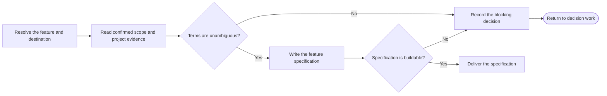

# PTLam Creating Feature Specifications

Turn one confirmed feature scope into one buildable feature specification. The
spec owns solution behavior and constraints; it does not own product discovery,
market framing, success metrics, ticket slicing, or implementation.

## Required skills

### `ptlam-explaining`

**Reason:** Makes unfamiliar feature behavior reconstructable for the document's reader without changing confirmed product or technical constraints.

**Instructions:** Read and apply ptlam-explaining before drafting the feature spec.
Infer the reader's likely difficulty from the confirmed scope and
project evidence; do not start another interview.
Let it own the literal model, explanatory structure, teaching order,
and reconstruction check for unfamiliar or complex content.
Use its explanation package inside the spec without changing facts,
contracts, schema, destination, or readiness owned by this skill.
Enter the analogy branch only when the user explicitly requested it.

Read [ptlam-explaining](skills/ptlam-explaining/SKILL.md).

### `ptlam-mermaiding`

**Reason:** Turns material behavior and system relationships into verified visuals that make the specification faster to scan and understand.

**Instructions:** Read ptlam-mermaiding before choosing the spec's visual form.
Apply it to material sequences, hierarchies, states, dependencies,
interactions, or other relationships; use a table for exact mappings
or comparisons.
Let it own the visual question, diagram type, Mermaid source, and the
strongest available syntax and rendering verification.
Keep this skill's ownership of feature facts, document structure,
visual placement, destination, and readiness.
Make each visual replace equivalent prose rather than repeat it.

Read [ptlam-mermaiding](skills/ptlam-mermaiding/SKILL.md).

### `ptlam-architecturing`

**Reason:** Supplies the suitability judgment behind any interface, data, compatibility, rollout, or migration structure the spec fixes and that is expensive to reverse.

**Instructions:** Read and apply ptlam-architecturing while modeling the feature
contract, whenever a contract element fixes a structure that is
expensive to reverse and no confirmed judgment or ADR already covers
it; otherwise record that source under the architecture constraints.
Let it own the constraints, solution-space frame, options,
trade-offs, sizing, recommendation, deferred concerns, and redesign
trigger.
Keep this skill's ownership of the feature contract, schema,
destination, status, and readiness.
Write the accepted recommendation into the spec as an architecture
constraint with its trade-offs, deferred concerns, and redesign
trigger, not as implementation mechanics.

Read [ptlam-architecturing](skills/ptlam-architecturing/SKILL.md).

## How does confirmed scope become a buildable specification?

Only `ptlam-grilling` interviews. This skill synthesizes confirmed evidence and
never re-asks a settled question. Route an outcome-changing unknown back to
decision work instead of choosing silently.

## 1. Resolve the feature and destination

Name the one feature this invocation specifies. A PRD scope item is the normal
source. A confirmed feature brief may replace it when the feature belongs to an
existing product. Start a new product or large epic at the PRD, and skip this
pipeline for a small fix.

Read the applicable `AGENTS.md` files before resolving paths. Use their spec
location when defined; otherwise write to
`<project-root>/docs/specs/<feature>/spec.md`.

Invocation authorizes creating that one file and missing parent directories. It
does not authorize overwriting an existing spec, changing source evidence,
creating tickets, changing code, or performing Git operations. Update an
existing spec only when the user requested that effect.

Complete this step when the feature, confirmed source, project root,
destination, and file authority are explicit.

## 2. Read the evidence

Read the complete confirmed source and the repository evidence needed to make
the feature buildable. Record the exact source path and heading. For a direct
feature brief, record its durable artifact or the user-approved statement and
state why no PRD applies.

Resolve the project's glossary from `AGENTS.md`; otherwise look for
`<project-root>/CONTEXT.md`. When no glossary exists, mark it unavailable and
keep business terms exactly as the confirmed source and repository use them. A
missing glossary alone does not block the spec. Conflicting or materially
ambiguous terms do.

Treat the PRD as product evidence, not a draft specification. Never push
solution mechanics back into it.

Complete this step when each requirement and constraint has a traceable source,
and every material term is clear or recorded as a blocker.

## 3. Model the feature contract

Describe the externally observable contract before solution detail:

- actors, permissions, entry conditions, and boundaries;
- successful behavior in execution order;
- validation, failure, recovery, idempotency, and concurrency behavior;
- data ownership, lifecycle, privacy, and retention constraints;
- interfaces and compatibility promises;
- operational signals, rollout, migration, and rollback constraints;
- structures expensive to reverse, judged by the loaded architecture skill and
  recorded as architecture constraints with their trade-offs, deferred concerns,
  and redesign trigger; and
- behaviors that evidence must prove.

Add only mechanics required to remove an implementation decision or protect a
contract. Preserve deliberate implementation freedom. Leave test levels,
placement, doubles, and tool mechanics to `ptlam-code-style`.

Complete this step when an implementer can distinguish required behavior from
permitted implementation choice.

## 4. Write the feature specification

Read
[the feature specification schema](references/feature-specification-schema.md).
It owns the file shape, status rules, and readiness checks. Write source facts,
repository evidence, assumptions, and unresolved decisions as distinct kinds of
information.

Do not conduct discovery to fill a gap. When a missing decision changes
behavior, scope, data, structure, compatibility, or rollout, persist the spec
with status `blocked` and name the exact decision owner and consequence.

Complete this step when the destination contains one self-contained spec and
every section in the schema has an explicit disposition.

## 5. Verify and deliver

Check the spec against the schema's readiness checks and its cited evidence.

Report the file, status, source scope, glossary state, checks performed, and any
blocking decision.

Complete the task when the written file matches its evidence and is either ready
for ticket planning or blocked with the exact missing decision exposed.
