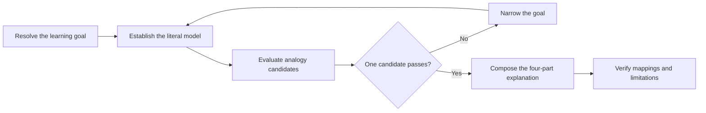

# PTLam Explaining with Analogy

Explain one unfamiliar concept through one vivid, structurally faithful
real-life analogy. The result contains a concise literal summary, stable
mappings, a story that demonstrates the mechanism, and explicit limitations.

When another skill calls this one, return those four semantic components and
let the caller own their rendering. When answering the learner directly, use
the compact Markdown shape defined below. This skill returns an explanation and
does not change files.

## Required skills

### `ptlam-explaining`

**Reason:** Provides the learning goal, literal model, and verification the analogy is built on.

**Instructions:** Read and apply ptlam-explaining first.
Let it own the learning goal, depth, the literal model, composition
order, and verification.
Enter this skill only when the learner explicitly asked for an
analogy, and apply it only to analogy selection, the mapping gate, the
story, and the stated limits.

Read [ptlam-explaining](skills/ptlam-explaining/SKILL.md).

## At a glance



## 1. Resolve the learning goal

Identify:

- the concept to explain;
- the learner's background and existing knowledge;
- the mechanism that is confusing;
- any analogy domain the learner supplies, requires, or rules out; and
- the requested depth, language, and output constraints.

If the concept is missing or too vague to explain accurately, ask what the
learner wants explained. Otherwise, infer ordinary presentation choices and
continue.

Complete this step when the concept, learning goal, confusing mechanism, depth,
language, analogy constraints, and output constraints are known or safely
inferred.

## 2. Establish the literal model

Capture the minimum real structure needed for the learning goal before choosing
an analogy:

- essential actors, objects, and boundaries;
- ownership, containment, dependencies, and cardinality;
- inputs, outputs, order, handoffs, and causal rules;
- relevant states, transitions, lifetimes, and failure behavior; and
- exact constraints, exceptions, or facts that must remain literal.

Cover only the mechanism needed at the requested depth. Verify claims when the
request or risk requires it. Exclude uncertain details rather than inventing
them to make an analogy fit.

Complete this step when every material relationship and rule within scope is
captured and uncertain claims are verified or excluded.

## 3. Choose one faithful analogy

For each candidate, build an internal mapping ledger:

```text
literal concept -> analogy counterpart -> preserved behavior -> known limit
```

A candidate passes only when it meets the complete mapping gate:

1. Every essential literal concept maps to one stable analogy counterpart.
2. Ownership, direction, order, state, cardinality, lifetime, and causality are
   preserved wherever they matter.
3. No analogy element represents unrelated concepts.
4. Exact facts and constraints remain literal.
5. No material rule requires a misleading mapping, unexplained exception, or
   second metaphor.

Treat a learner-supplied domain as the first candidate. Use it when it passes.
When it fails, name the material mismatch and offer passing alternatives instead
of silently replacing it.

When no supplied domain passes, generate several candidates internally. Prefer
an everyday domain the learner can picture, one coherent world, strong
relationship fidelity, broad coverage, and low explanation cost.

These familiar domains are starting points, not defaults:

| Concept pattern | Possible analogy domain |
| --- | --- |
| Ordered sequential work | Recipe or assembly line |
| Fast storage and retrieval | Library or filing cabinet |
| Broadcasting to unknown listeners | Radio station or newsletter |
| Complexity behind a simple surface | Restaurant menu |
| Concurrent work | Multiple cooks in one kitchen |
| Agreed communication rules | Introductions or phone etiquette |
| Adjustment from observed output | Thermostat |
| Work distributed across resources | Traffic control |

Use the strongest passing candidate without adding a selection turn unless the
learner asks to choose, rejects the current analogy, or the candidates expose
meaningfully different teaching trade-offs.

When selection helps, present at most three passing candidates. For each, give a
short domain name, one sentence about the structural similarity, and the
material teaching trade-off. Mark the strongest **(Recommended)**, ask which to
use, and wait. Never offer a candidate that failed the mapping gate.

If no coherent candidate passes, ask the learner to narrow the goal instead of
forcing a weak analogy.

Complete this step when one passing analogy is selected, every learner-supplied
domain is honored or rejected for a named mismatch, and any required user choice
is settled.

## 4. Compose the explanation

Lock the selected analogy domain and use it throughout. Calibrate vocabulary and
depth to the learner. Be vivid without weakening precision.

Produce these four components in order. A calling skill may transform their
presentation while preserving their meaning. For direct Markdown delivery, use
this shape without an extra introduction or conclusion.

### In a sentence

Write one assertive, jargon-free sentence that captures the concept's essence.
Avoid hedges such as “basically” or “kind of.” Format it as a blockquote:

> [One-sentence literal summary]

### The map

Translate each essential story element into exactly one real concept:

| In the story | In [concept name] | Why it maps |
| --- | --- | --- |
| [analogy element] | [literal element] | [preserved relationship or behavior] |

### The story

Tell a short story entirely inside the analogy domain and in second person. Do
not name the literal concept inside the story. Use an ordered list when sequence
or causality matters; otherwise use concise prose or bullets.

### Where it breaks

Name every material way the analogy omits, oversimplifies, or misrepresents the
literal concept. One or two limitations will usually be enough. If many caveats
are needed, reject the analogy and select a stronger candidate.

Complete this step when all four components are present, fit the learner, and
disclose every material limitation.

## 5. Verify the explanation

Confirm that:

- every essential literal concept has one stable counterpart;
- ownership, direction, order, state, cardinality, lifetime, and causality are
  preserved where relevant;
- no analogy element represents unrelated concepts;
- the story demonstrates the mechanism instead of decorating it;
- exact facts remain literal in the map or limitations; and
- the learner can reconstruct the literal concept from the map without relying
  on the story alone.

If drafting reveals a failed mapping, do not return it. For an automatically
selected analogy, use the next strongest passing candidate. For a
learner-selected analogy, explain the discovered limitation and offer fresh
passing candidates instead of silently overriding the choice.

Complete this step when the explanation passes every check and is ready for the
caller to render or for direct delivery.

## 6. Handle follow-ups

| Learner asks for | Response |
| --- | --- |
| A different analogy | Offer at most three fresh passing candidates, excluding the analogy just used. |
| More depth | Expand the literal model, then revalidate the analogy. Keep it only if it still passes. |
| A simpler version | Narrow the learning goal, then choose a more everyday candidate that passes. |
| A related concept | Start a new literal model and link back only where useful. |
| A challenge to the analogy | Name the limitation and structural rationale; offer fresh candidates when needed. |

Complete a follow-up when its new scope passes the same literal-model, mapping,
composition, and verification steps.
