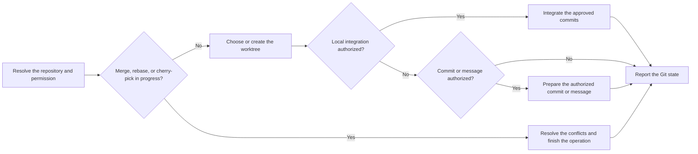

# PTLam Git

Carry out one requested commit, worktree, or conflict-resolution workflow in the
right repository and worktree without disturbing unrelated work. This skill may
create local branches, linked worktrees, and commits when the request allows
that change.

It does not push, start a merge or rebase, delete a branch, or discard changes
unless the user explicitly asks. A read-only Git question never allows a
worktree or a commit. A user-authorized parent workflow may delegate explicitly
listed local effects: scoped branches, worktrees, commits, and cherry-picks onto
its dedicated integration branch. Accept only that existing permission; it
grants no push, publication, shared-branch merge, deletion, or discard.

## Which Git workflow does the request need?

## 1. Resolve the repository and permission

Resolve one repository from the user's paths and the current directory. Read the
request and every applicable `AGENTS.md` or similar instruction from the
repository root down to the files in scope. When a parent delegates work, record
its user authorization and exact local operations, paths, branches, and commits.

Run `git status --short --branch` and `git worktree list --porcelain` before
choosing where to work. Leave user changes, active branches, and existing
worktrees outside the request untouched.

Done when the repository, the requested operation, the permitted side effects,
and the unrelated state are known.

## 2. Resolve an in-progress conflict

When Git reports a merge, rebase, or cherry-pick in progress, read
[resolving merge conflicts](references/resolving-merge-conflicts.md). Stay in
that exact worktree. The reference owns finding both intents, resolving each
hunk, running project checks, and finishing the operation.

Done when Git reports no in-progress operation and no unmerged path. Do not
continue into the worktree or commit steps.

## 3. Choose the worktree

Read [the worktree policy](references/worktree-policy.md) when the user asks to
create, use, move, repair, remove, or prune a worktree, or before any write when
the current worktree may not be the right place. It decides whether to stay or
to create `.worktrees/<task-slug>`, and how to manage a linked worktree safely.

After creating or picking a linked worktree, run every task command from it. Do
not keep editing from the checkout that started the work.

Done when one exact worktree and branch own the requested change.

## 4. Integrate authorized local commits

Enter only for an explicitly authorized local integration. Verify the dedicated
integration branch, its clean worktree, and the approved worker commits; then
cherry-pick those exact commits in dependency order. For a conflict, use step 2
in that worktree. Run the combined checks and report the resulting commit range.

Done when the approved commits are integrated and checked. Report the final Git
state without creating another commit.

## 5. Prepare the commit

Enter when the user requests a commit or message, or an already authorized
parent explicitly delegates a scoped local commit. Inspect the whole diff, using
the staged diff when one exists. If a commit is allowed and nothing is staged,
stage only the explicit paths that belong to the requested outcome. Never widen
the commit just to make the worktree clean.

Read [writing a Git commit message](references/writing-git-commit-message.md).
It owns which preference wins, how to build the message, and the final check. If
the user asked only for wording, return the message without changing Git.

Before committing, run the checks the request and repository rules require.
Report any check you could not run; never call it passed.

Done when the staged patch, the message, and the check results describe one
coherent outcome.

## 6. Commit and report

Create only the authorized commit. Let repository hooks run. If a hook changes
files or rejects the commit, inspect the result and report it instead of
bypassing the hook or retrying quietly.

Verify with `git status --short --branch` and `git log -1 --oneline`. Report the
worktree path, branch, commit hash and subject when created, checks run, and any
remaining changes or doubt.

Finish when the requested Git state exists, unrelated work is unchanged, and the
report matches the verified repository state.
