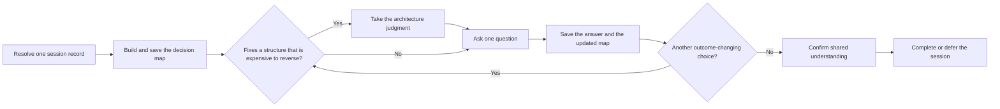

# PTLam Grilling

Stress-test a plan, decision, or idea by asking the user one consequential
question at a time. The agent finds the facts it can check and recommends an
answer; the user owns every decision that changes the outcome.

This is the only skill in the catalog that interviews the user. Every session
has one saved record, so another agent can resume from the latest decision map
without the chat history.

## Required skills

### `ptlam-modeling-domain`

**Reason:** Keeps contested business language and context boundaries durable while the interview is still resolving them.

**Instructions:** Read ptlam-modeling-domain before the interview loop.
Apply it when a business term is contested, overloaded, or new, or
when a business context boundary becomes unclear.
Let it own the glossary, context boundaries, and business process map
in CONTEXT.md.
Keep this skill's ownership of the questions, decision map, session
record, and confirmation loop.

Read [ptlam-modeling-domain](skills/ptlam-modeling-domain/SKILL.md).

### `ptlam-architecturing`

**Reason:** Supplies the recommendation, strongest alternative, and main trade-off for a decision that fixes a structure expensive to reverse.

**Instructions:** Read ptlam-architecturing before the interview loop.
Apply it when the selected decision fixes a component, runtime, or
data-store split, a published surface, where the true copy of state
lives, or a platform commitment.
Let it own the constraints, frame, options, trade-offs, sizing,
recommendation, and redesign trigger.
Keep this skill's ownership of the questions, decision map, session
record, and confirmation loop.
Let it write no file; record its judgment in the session record.

Read [ptlam-architecturing](skills/ptlam-architecturing/SKILL.md).

## How does one open decision become saved shared understanding?

| Concern      | Rule                                                                                                                                              |
| ------------ | ------------------------------------------------------------------------------------------------------------------------------------------------- |
| Decision     | The agent recommends; the user owns every outcome-changing choice.                                                                                |
| File effect  | This run may write its session record, the domain context, and qualifying ADRs at their resolved paths. The architecture judgment writes no file. |
| Later action | Implementation, Git operations, and publication need separate permission.                                                                         |
| Done         | The user confirms the saved decision map, or the record names each deferred choice and its consequence.                                           |

## 1. Resolve the session record

1. Read the [session schema](references/grilling-session-schema.md). It owns the
   workspace root, the record location, the record shape, and the status
   lifecycle.
2. Inspect that folder, the candidate path, and records on the same topic.
3. Resume one clear unfinished match unless the user asks to start fresh. When
   several records could match, ask which one to continue.
4. Read a resumed record in full. Recheck evidence that may have changed, then
   continue from its next open decision without repeating settled ones.
5. Before the first real question, have each loaded skill resolve the extra
   destination it owns. Show the record path and every other destination
   together so the user can narrow or refuse them before any write. When a
   filename depends on a decision not yet made, show the folder and naming rule
   now and the exact path before its first write.

Done when the workspace root, schema, one unique record path, every possible
write destination, prior state, and write permission are known and shown.

## 2. Build the decision map and save the checkpoint

1. State the intended outcome, known constraints, non-goals, and the result the
   discussion will eventually enable.
2. Inspect repository files, tools, prior decisions, and other evidence. Do not
   ask the user for facts you can check safely.
3. Map prerequisites, downstream effects, assumptions, conflicts, settled
   branches, and open user-owned decisions.
4. Separate consequential choices from reversible mechanics. Pick and state a
   sensible default for low-impact mechanics.
5. Create or update the session record with the current map. For a new session,
   write the first checkpoint before the first real question, then tell the user
   the record path.

If saving fails, report the path and the reason. Do not claim the session is
resumable or ask the next question.

Done when the map holds the outcome, non-goals, constraints, evidence,
prerequisites, assumptions, conflicts, and known choices; the highest-impact
answerable decision is clear; and the saved record matches.

## 3. Ask one decision at a time

1. Pick the highest-impact open decision whose prerequisites are known.
2. When that decision fixes a structure that is expensive to reverse, take the
   recommendation from the loaded architecture skill. It recommends; this skill
   asks and records; the user decides.
3. When that judgment leaves one open question, ask it first.
4. Ask exactly one question. Say why it matters now, the recommended answer and
   reason, the strongest alternative, and the main trade-off.
5. Wait for the answer before asking another question.
6. Record the answer, then update the map to show what it settles, changes, or
   invalidates downstream.
7. Challenge contradictions with evidence. Reopen an earlier branch when a new
   answer makes it inconsistent.
8. Save the checkpoint before yielding with the next question.

Use concrete scenarios and counterexamples when an abstract answer could hide
different meanings.

Done when no answerable outcome-changing decision remains and the record shows
every settled, invalidated, open, or deferred branch with its owner and
consequence.

## 4. Confirm shared understanding

Summarize the outcome, non-goals, decisions, accepted assumptions, risks,
deferred decisions, and the next allowed action. Save that summary, ask whether
it matches the shared understanding, and wait.

If the user corrects it, update the map and resume from the highest-impact open
decision. If the user asks to stop or to act before confirming, save the session
as `deferred` and report the open decisions. An early request to act is not
confirmation. Do not act on the map until the user confirms it.

Finish when every outcome-changing decision is settled or explicitly deferred,
the user has confirmed, the confirmation is saved, and the status is `complete`.

See [acknowledgements](ACKNOWLEDGEMENTS.md) for the source that inspired this
workflow.
