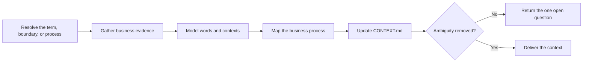

# PTLam Modeling Business Domains

Keep one project's business words, context boundaries, and business process map
in `CONTEXT.md`. This skill owns business meaning. It does not own code types,
database schemas, transport models, or serialization.

## Required skills

### `ptlam-mermaiding`

**Reason:** Owns the business process diagram that makes handoffs and decisions visible without repeating them in prose.

**Instructions:** Read and apply ptlam-mermaiding for every business process map.
Let it own the visual question, diagram type, notation, Mermaid
source, and the strongest available syntax and rendering check.
Keep this skill's ownership of business facts, vocabulary, context
boundaries, document placement, and glossary checks.
Make the process diagram replace equivalent prose rather than repeat
it.

Read [ptlam-mermaiding](skills/ptlam-mermaiding/SKILL.md).

## How does an unclear business word become shared context?

Use this skill when a business term is contested, overloaded, or new; when two
contexts use one word differently; or when a business process needs a durable
map. This skill does not interview. When a decision belongs to the user, return
that one question to the caller.

## 1. Resolve the trigger and permission

Name the term, boundary, or process that started the work. Read the applicable
`AGENTS.md` files before choosing the destination. Use their domain-context
location when defined; otherwise use `<project-root>/CONTEXT.md`.

A direct request or a parent skill may allow creating or updating the managed
sections of that file. Without that permission, return a proposed patch and the
exact destination. Never overwrite unrelated content.

Done when the business question, project root, destination, existing content,
and write permission are explicit.

## 2. Gather business evidence

Read the confirmed conversation record, product documents, the existing
`CONTEXT.md`, user-facing text, and code only where it shows current business
usage. Treat code names as evidence, not definitions.

Keep verified meaning, user decisions, current usage, contradictions, and
assumptions apart. Search before claiming a term is shared or that two contexts
differ.

Done when every proposed definition, boundary, step, and handoff has a source or
is marked as an open question.

## 3. Model words and context boundaries

Give each term one precise meaning inside one named context. Say what the term
does not mean when a neighboring meaning could creep back. When two contexts use
one word differently, keep both definitions and name the translation at their
boundary.

For each context, state its responsibility, its words, its invariants, what
business information comes in and goes out, and how it relates to other
contexts. Keep technical modules and deployment boundaries out of `CONTEXT.md`
unless they are also verified business boundaries. A verified context boundary
is a candidate component boundary for architecture work; a contested business
term comes back here to be defined.

Done when a reader can use every term and cross each boundary without guessing
which meaning applies.

## 4. Map the business process

Model the process from the business event that starts it through actors,
decisions, handoffs, outcomes, and material exceptions. Show business
responsibility, not implementation calls.

When an ambiguity would change the outcome, return one exact question to the
caller. Outside an interview, record it as open.

Done when the map covers the normal path and each material branch, or names the
evidence needed to finish it.

## 5. Update and verify the context

Read [the domain context schema](references/domain-context-schema.md). It owns
the managed sections, merge rules, and completion checks. Keep everything
outside those sections unchanged.

Report the file or proposed patch, changed terms and boundaries, the process map
check, open questions, and checks performed.

Finish when the managed sections match their evidence and the triggering
ambiguity is removed or reduced to one exact open decision.
