# PTLam Health Connector Adding a Data Type

Add one health data type and its record through every supported Health Connector
layer. Keep unsupported platforms explicit instead of shipping a partial
registration that compiles but fails on a device.

## Required skills

### `ptlam-health-connector-architecture`

**Reason:** Provides the package, channel, platform, public API, and compatibility boundaries the end-to-end change must preserve.

**Instructions:** Read and apply ptlam-health-connector-architecture first.
Let it own package direction, public and internal surfaces, Pigeon
ownership, native layers, failure translation, concurrency, and
platform limits.
Use this skill to carry one health data type through those
boundaries.

Read [ptlam-health-connector-architecture](skills/ptlam-health-connector-architecture/SKILL.md).

### `ptlam-health-connector-code-style-dart`

**Reason:** Provides the project's Dart conventions for the core model, contracts, mappers, documentation, and tests.

**Instructions:** Apply ptlam-health-connector-code-style-dart to every Dart change.
Let it own Dart analyzer, formatter, documentation, logging, and test
conventions.
Keep this skill's ownership of the end-to-end feature workflow.

Read [ptlam-health-connector-code-style-dart](skills/ptlam-health-connector-code-style-dart/SKILL.md).

### `ptlam-health-connector-code-style-kotlin`

**Reason:** Provides the project's Kotlin conventions for the Android mapper, handler, registry, and tests.

**Instructions:** Apply ptlam-health-connector-code-style-kotlin when the type supports
Android Health Connect.
Let it own Kotlin formatting, analysis, visibility, and test
conventions.
Keep this skill's ownership of Android feature completeness.

Read [ptlam-health-connector-code-style-kotlin](skills/ptlam-health-connector-code-style-kotlin/SKILL.md).

### `ptlam-health-connector-code-style-swift`

**Reason:** Provides the project's Swift conventions for the iOS mapper, handler, registry, and native logging.

**Instructions:** Apply ptlam-health-connector-code-style-swift when the type supports
iOS HealthKit.
Let it own Swift formatting, analysis, visibility, and logging
conventions.
Keep this skill's ownership of iOS feature completeness.

Read [ptlam-health-connector-code-style-swift](skills/ptlam-health-connector-code-style-swift/SKILL.md).

## How does one data type become reachable on every platform?

```mermaid
flowchart LR
    ResolveContract["Resolve the record and platform contract"] --> AddCore["Add core record, data type, exports, registrations"]
    AddCore --> AddPigeon["Add each supported Pigeon DTO and enum case"]
    AddPigeon --> Regenerate["Regenerate all channel outputs once"]
    Regenerate --> AddDartMappers["Add each supported Dart mapper path"]
    AddDartMappers --> SupportsAndroid{"Supports Android?"}
    SupportsAndroid -->|"Yes"| AddAndroid["Add Health Connect mapping, handler, registry entry"]
    SupportsAndroid -->|"No"| SupportsIos{"Supports iOS?"}
    AddAndroid --> SupportsIos
    SupportsIos -->|"Yes"| AddIos["Add HealthKit mapping, handler, registry entry"]
    SupportsIos -->|"No"| Verify["Verify generation, checks, tests, docs, device evidence"]
    AddIos --> Verify
```

## 1. Resolve the contract

Record these from the request, current SDK source, and installed platform SDKs:

- public data-type and record names, the stable `snake_case` id, and the family
  folder;
- instant, interval, or series record shape, with every field and bound;
- measurement unit and aggregation result unit;
- read, write, update, delete, aggregate, and sync capabilities per platform;
- Health Connect record and permission mappings;
- HealthKit sample identifier, unit, permission, and minimum iOS version; and
- SDK release annotation and public documentation category.

Stop before editing when a platform mapping or capability is still a guess.
Leaving out an unsupported platform is fine; inventing parity is not.

Done when every item above is known or explicitly unsupported.

## 2. Complete each stage

1. Add the domain model, singleton, capability interfaces, support metadata,
   public export, and Dart registrations through
   [core and Dart](references/core-and-dart.md). Done when core analysis reports
   no missing exhaustive case.
2. Add the DTO and enum cases to each supported Pigeon contract only. Run
   `melos run pigeon` once from the monorepo root, then write the Dart mappers.
   Done when source and generated contracts agree in both directions.
3. When Android is supported, complete
   [the Health Connect path](references/android.md). Done when the registry
   resolves a handler with every declared capability.
4. When iOS is supported, complete [the HealthKit path](references/ios.md). Done
   when the registry resolves the handler on every supported OS version and
   rejects older versions precisely.
5. Apply [the verification matrix](references/verification.md). Done when every
   supported platform has behavior evidence and every unsupported platform has a
   truthful public contract.

## 3. Finish

Report the type's capabilities by platform, changed packages and generated
files, check results, native evidence, and anything unverified.

Finish when no dispatcher, permission map, public export, registry, or generated
output can leave the type out silently, every supported platform has behavior
evidence, and every unsupported platform has a truthful public contract.
