# PTLam Health Connector Architecture

Explain how one Health Connector behavior crosses the Flutter monorepo, or judge
which boundary should own a proposed change. Base every answer on the current
checkout; paths and committed configuration outrank neighboring `CLAUDE.md`
summaries.

This skill owns system structure and contracts. It does not own environment
installation, diagnosis of one failing run, whole-diff review, feature
implementation, or language style.

## How does one SDK call reach a platform store?

```mermaid
flowchart LR
    App["Flutter application"]
    Facade["health_connector facade"]
    PlatformClient["Dart platform client"]
    PigeonContract["Pigeon contract and generated channel"]
    NativePlugin["Kotlin or Swift plugin entry point"]
    NativeClient["Native client"]
    Handler["Service or record handler"]
    PlatformStore["Health Connect or HealthKit"]

    App --> Facade
    Facade --> PlatformClient
    PlatformClient --> PigeonContract
    PigeonContract --> NativePlugin
    NativePlugin --> NativeClient
    NativeClient --> Handler
    Handler --> PlatformStore
```

The return path reverses the same boundaries through platform records, native
DTOs, Pigeon, Dart DTO mappers, and domain records.

## Resolve an architecture question

1. Name the observable operation, caller, supported platforms, and public result
   or failure. Done when the contract can be stated without naming an
   implementation.
2. Locate the owning package and entry library with
   [workspace and API surfaces](references/workspace-and-api-surfaces.md). Done
   when dependency direction and audience are explicit.
3. Trace the call and return paths through
   [the platform channel](references/platform-channel.md). Done when every
   handoff and generated surface has an owner.
4. Read the native branch that applies: [Android](references/android.md),
   [iOS](references/ios.md), or both. Done when the client, service or handler,
   mapper, concurrency boundary, and host-app precondition are accounted for.
5. Judge the proposal against the public API, error-code, platform-support,
   privacy, and generated-code contracts. Done when the answer names the
   smallest owning layer and every other layer that must remain unchanged.

## Return the result

For an explanation, give the literal path and the state transformed at each
boundary. For a placement decision, name the owner, the interfaces it may use,
and the layers it must not absorb. For a compatibility judgment, separate the
verified current behavior, the proposed behavior, and the breaking or
platform-specific consequence.

Finish when each claim points to current source or committed configuration and
every material platform difference is visible.
