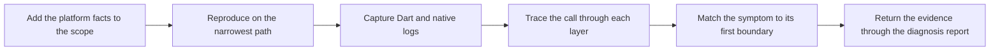

# PTLam Health Connector Diagnosing

Gather Health Connector runtime evidence for one failing SDK behavior and return
it through the loaded diagnosis skill. This specialization owns only the
project's capture fields, reproduction commands, privacy rules, symptom routes,
and the Dart, Pigeon, Android, and iOS tracing mechanics.

## Required skills

### `ptlam-diagnosing`

**Reason:** Provides the general read-only diagnosis workflow, evidence model, hypothesis ranking, failing-boundary standard, report, and stop condition.

**Instructions:** Read and apply ptlam-diagnosing first.
Let it own the diagnosis scope; reproduction and evidence rules;
observation, inference, and assumption labels; hypothesis ranking;
failing-boundary model; read-only limits; report; and completion.
Use this skill only for Health Connector capture fields, commands,
logging and privacy mechanics, tracing references, symptom routes,
and platform completion mechanics.
The foundation's permission, evidence, and completion rules win. This
specialization may be stricter, never looser.

Read [ptlam-diagnosing](skills/ptlam-diagnosing/SKILL.md).

### `ptlam-health-connector-architecture`

**Reason:** Supplies the package, channel, native-layer, and platform-boundary model needed to locate a failure.

**Instructions:** After ptlam-diagnosing, read and apply
ptlam-health-connector-architecture.
Let it own package boundaries, call paths, Pigeon ownership, native
layers, failure translation, concurrency, and platform constraints.
Use this skill only to gather Health Connector runtime evidence
against those boundaries. Return that evidence through
ptlam-diagnosing's boundary model and report.

Read [ptlam-health-connector-architecture](skills/ptlam-health-connector-architecture/SKILL.md).

## How does a symptom become traced evidence?



## 1. Capture the evidence

1. Add the operation, platform, OS version, device or simulator, data type,
   public exception, and error code to the diagnosis scope. Done when the
   platform conditions and the public failure are identifiable.
2. Run the narrowest existing test or example path. Use a package-local
   `fvm flutter test <path>` for Dart and `melos run test:kotlin` for Kotlin;
   the Kotlin task must run through the example app. Done when one command or
   user action shows the symptom.
3. Capture both Dart and native structured logs. Use this configuration when it
   already exists or the user separately allows diagnostic instrumentation:

   ```dart
   const config = HealthConnectorConfig(
     loggerConfig: HealthConnectorLoggerConfig(
       enableNativeLogging: true,
       logProcessors: [DeveloperLogProcessor()],
     ),
   );
   final connector = await HealthConnector.create(config);
   ```

   Keep the logs around the first failing operation. If adding the configuration
   needs an unauthorized source edit, record native logs as unavailable. Never
   add health values, record ids, or user-owned timestamps to diagnostic output.

4. Trace the call and response through
   [Dart and the channel](references/dart-and-channel.md), then the applicable
   [Android](references/android.md) or [iOS](references/ios.md) route. Record
   the input, output, completion, and failure mapping at each layer for the
   diagnosis boundary model.

## 2. Match the symptom

| Symptom                                                 | First boundary to inspect                                                                                   |
| ------------------------------------------------------- | ----------------------------------------------------------------------------------------------------------- |
| `create()` reports unavailable or update required       | Platform-status call and native client creation                                                             |
| `PERMISSION_NOT_DECLARED`                               | Host `AndroidManifest.xml` or iOS usage descriptions                                                        |
| A read permission is always `unknown` on iOS            | Expected HealthKit privacy behavior, not a denial                                                           |
| `UNSUPPORTED_OPERATION` for a supported type            | Dart `supportedHealthPlatforms`, Pigeon enum, native registry, then capability conformance                  |
| Wrong fields or units                                   | Domain-to-DTO mapper, native mapper, then the reverse path                                                  |
| A new DTO or method is missing after editing Pigeon     | Contract and committed generated files are out of step                                                      |
| Native logs never reach Dart                            | Logger config, native enabled flag, and reverse Pigeon API setup                                            |
| Android test cannot resolve Flutter classes             | Test ran in the plugin module instead of through the example app                                            |
| iOS `EXC_BAD_ACCESS` near Flutter channel serialization | An async completion bypassed the main-thread helper                                                         |
| A call hangs                                            | Missing callback or completion, cancelled scope or task, detached activity, or unresolved permission result |

Done when the symptom points at one first boundary to inspect, or no row matches
and the trace from step 1 names the boundary instead.

## 3. Complete the platform evidence

Account for the public exception or missing completion, platform prerequisites,
permission semantics, generated-contract state, and the logging path that apply
to the symptom. Keep source observations apart from device, simulator, or test
observations.

Finish when the public call is traced through every relevant Dart, Pigeon,
native, and platform layer, unavailable platform checks are explicit, and the
evidence is returned through the loaded diagnosis report.
