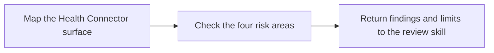

# PTLam Health Connector Reviewing

Add Health Connector project and platform risks to the loaded code-review skill.
Keep its review surface, read-only rule, finding gate, severity, output shape,
and readiness verdict unchanged.

## Required skills

### `ptlam-reviewing-code`

**Reason:** Provides the general read-only review workflow, evidence gate, severity model, verification limits, and readiness verdict.

**Instructions:** Read and apply ptlam-reviewing-code first.
Let it own the review scope, intent, general code risks, finding
admission, severity, output shape, and readiness verdict.
Use this skill only for Health Connector project and platform risks.
Return its findings and verification limits through the foundation's
report.

Read [ptlam-reviewing-code](skills/ptlam-reviewing-code/SKILL.md).

### `ptlam-health-connector-architecture`

**Reason:** Provides the repository boundaries and cross-platform contracts the review must protect.

**Instructions:** After ptlam-reviewing-code, read and apply
ptlam-health-connector-architecture before judging project risks.
Let it own package direction, public and internal surfaces, Pigeon
ownership, native layers, failure boundaries, concurrency, and
platform limits.
Use this skill to judge the diff against that architecture.

Read [ptlam-health-connector-architecture](skills/ptlam-health-connector-architecture/SKILL.md).

### `ptlam-health-connector-code-style-dart`

**Reason:** Provides Health Connector Dart source, analyzer, documentation, and test conventions for changed Dart files.

**Instructions:** Apply ptlam-health-connector-code-style-dart to changed Dart, YAML,
and Dart-test files.
Let it own project-specific Dart writing and check conventions.
Report violations here without copying its rules into this skill.

Read [ptlam-health-connector-code-style-dart](skills/ptlam-health-connector-code-style-dart/SKILL.md).

### `ptlam-health-connector-code-style-kotlin`

**Reason:** Provides Health Connector Kotlin source, ktlint, detekt, and unit-test conventions for changed Android files.

**Instructions:** Apply ptlam-health-connector-code-style-kotlin to changed Kotlin,
Gradle, ktlint, detekt, and Kotlin-test files.
Let it own project-specific Kotlin writing and check conventions.
Report violations here without copying its rules into this skill.

Read [ptlam-health-connector-code-style-kotlin](skills/ptlam-health-connector-code-style-kotlin/SKILL.md).

### `ptlam-health-connector-code-style-swift`

**Reason:** Provides Health Connector Swift source, SwiftLint, SwiftFormat, and native logging conventions for changed iOS files.

**Instructions:** Apply ptlam-health-connector-code-style-swift to changed Swift,
SwiftPM, SwiftLint, and SwiftFormat files.
Let it own project-specific Swift writing and check conventions.
Report violations here without copying its rules into this skill.

Read [ptlam-health-connector-code-style-swift](skills/ptlam-health-connector-code-style-swift/SKILL.md).

## How do project risks enter the review?

## 1. Map the Health Connector surface

1. Name every affected package, language, public library, Pigeon contract,
   native layer, platform, test suite, document, and changelog.
2. Treat committed configuration and code as the truth over `CLAUDE.md`.
3. Match every generated file in the surface to its Pigeon source and the Swift
   post-processor.

Done when the surface names every affected part and every generated file has its
source.

## 2. Check the four risk areas

### Correctness and failure behavior

- Check validation, empty and boundary inputs, paging, timestamps, units, ids,
  platform availability, and capability checks.
- Trace exceptions through native translation, Pigeon error DTOs, Dart mapping,
  and the public exception type. Keep cancellation and completion behavior
  intact.
- Check that logs and error details hold no health values, ids, user-owned
  dates, or device names.

### Architecture and compatibility

- Keep package dependency direction and layer ownership intact.
- Treat public Dart exports, `@since` history, data-type ids, Pigeon DTOs,
  error-code strings, and plugin methods as release boundaries.
- Check Android handler registration and capabilities, iOS registration and
  availability gates, and every supported or unsupported platform branch.
- Flag hand-edited generated files. Compare each Pigeon source change with all
  expected generated outputs and the Swift post-processor.

### Project language conventions

Apply the loaded project language skills only to changed files in that language.
Report the violated rule and the smallest fix; do not repeat the whole
convention.

### Evidence and release impact

- Require focused tests for changed Dart and Kotlin behavior.
- Say plainly that Dart platform tests do not run native code and that the Swift
  package has no effective native test target.
- Check public dartdoc, platform limitations, examples, migration guidance,
  package changelogs, and semantic-version impact where behavior is public.
- Compare the intended checks with the Melos scripts and the relevant CI
  workflow.

Run Health Connector check-mode analysis or tests only under the review skill's
permission rules. Keep `melos run pigeon`, `melos run format`, baseline
generation, and every other rewriting command out of the review.

Done when each area has been checked against the changed files.

## 3. Return findings and limits

Return project findings and verification limits to the loaded review skill. It
assigns severity, orders the report, and decides the readiness verdict.

Finish when every project risk you found is either a finding with evidence and a
fix or a named verification limit.
