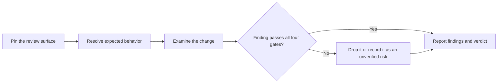

# PTLam Reviewing Code

Review one bounded code changeset and return a prioritized findings report and a
readiness verdict. A review is read-only: it does not edit, comment on the pull
request, approve, push, or merge.

## Required skills

### `ptlam-code-style`

**Reason:** Provides the language-neutral conventions a code review judges.

**Instructions:** Read and apply ptlam-code-style before judging source or tests.
Let it own precedence; complexity; source structure and boundaries;
naming and readability; data modeling; contracts; failures;
asynchronous lifetime; documentation; logging; evolution; and test
behavior, levels, placement, and doubles.
Apply a matching stack specialization when one exists.
Keep this skill's ownership of the review surface, intent, risk
examination, finding gate, severity, verification limits, and
readiness verdict.

Read [ptlam-code-style](skills/ptlam-code-style/SKILL.md).

### `ptlam-architecturing`

**Reason:** Supplies the judging-suitability standard for a changeset that introduces a structure expensive to reverse.

**Instructions:** Read ptlam-architecturing while examining the change.
Apply only its judging-suitability standard, and only when the
changeset introduces a component, runtime, or data-store split, a
published surface, state ownership, or a platform commitment.
Let it own the verdict on that structure and the stale rules of
thumb to re-check.
Keep this skill's ownership of the review surface, finding gate,
severity, and readiness verdict.
Skip it for a changeset that introduces no such structure.

Read [ptlam-architecturing](skills/ptlam-architecturing/SKILL.md).

## How does a changeset become a verdict?

## 1. Pin the review surface

1. Resolve the repository and worktree. Read the request and every applicable
   repository instruction from the root down to the changed files.
2. Pin one surface. Resolve every revision before reading the diff, then name
   the exact comparison and the changed-file list.

| Surface                  | Comparison                                                             |
| ------------------------ | ---------------------------------------------------------------------- |
| Uncommitted working tree | Staged and unstaged changes separately, including untracked files      |
| Commit or tag            | The requested revisions, with the user's stated meaning                |
| Branch                   | Its merge base with the requested base, unless the user says otherwise |
| Pull request             | Its exact base, head, commits, description, linked work, and CI state  |

Stop and report when a revision is invalid, the diff is empty, generated-file
ownership is unclear, or the requested scope cannot be separated from unrelated
work.

Done when the comparison and the changed files are exact.

## 2. Resolve expected behavior

Take the expected behavior from the user's task, a specification, an issue, or a
linked requirement. The pull-request description, tests, and changed docs are
claims about the implementation, not the source of truth. Without independent
intent, use those claims to understand the scope and say that conformance to a
specification is unverified.

Map the affected behavior, callers, boundaries, configuration, generated
ownership, tests, and release surfaces. Read tests first when they express the
changed behavior, then every changed file with enough surrounding code to trace
its effects.

Done when you can say what the change is supposed to do and what it touches.

## 3. Examine the change

Apply the loaded code-style skill to changed source and tests. Then cover the
risks conventions cannot settle:

| Concern                     | Look at                                                                                      |
| --------------------------- | -------------------------------------------------------------------------------------------- |
| Intent and correctness      | Required behavior, edge inputs, state changes, error paths, unintended scope                 |
| Regression evidence         | Whether tests fail without the change, cover the risk, and assert behavior, not structure    |
| Architecture and simplicity | Ownership, dependency direction, duplicate paths, speculative abstractions, moved complexity |
| Security and privacy        | Trust boundaries, validation, authorization, injection, secrets, sensitive output, defaults  |
| Concurrency and reliability | Races, cancellation, repeat-safety, retries, resource lifetime, partial failure, migrations  |
| Performance                 | Unbounded work, repeated I/O, N+1 access, blocking hot paths, large allocations, no paging   |
| Compatibility               | Public contracts, stored data, configuration, platforms, generated files, rollout            |

When a manifest or lockfile changes, read
[reviewing dependency changes](references/dependency-changes.md).

When the change introduces a structure the loaded architecture skill's trigger
names, read that skill's judging-suitability standard. Admit a finding on that
structure only when the verdict is "not yet suitable". Report an unknown need as
missing intent, not as a finding.

Use CI evidence only when it belongs to the exact revision under review. Run
check-mode commands only when permission and repository rules allow their files.
Never run formatters, generators, snapshot updates, baseline creation,
dependency installs, or any other rewriting command during a review. A passing
check narrows doubt; it never proves the change correct.

Done when every concern has been examined against the changed code.

## 4. Admit a finding

Report a finding only when all four hold:

1. The change introduces the defect or makes an existing one reachable.
2. The impact is concrete and matters to behavior, safety, operations, or
   maintenance.
3. The evidence names the file and the smallest useful line or range.
4. The fix is specific and no wider than the defect.

A code smell is a lead to investigate, never a finding on its own. Leave out
taste, speculative future concerns, unrelated existing defects, and tool output
that adds no diagnosis. Name a structural remedy when the defect is structural;
prefer the remedy that removes moving parts.

| Severity | Threshold                                                                                     |
| -------- | --------------------------------------------------------------------------------------------- |
| Critical | Exploitable security or privacy exposure, data loss, broken public contract, crash, or outage |
| Major    | Reachable wrong behavior, race, lost error, compatibility break, or architecture regression   |
| Minor    | Local maintainability or convention defect with a concrete cost and no present failure        |

Severity reflects impact, not confidence. Investigate uncertain evidence or
record it as an unverified risk; never promote a guess to a finding.

Done when every surviving finding passes all four gates and has a severity.

## 5. Report the verdict

Lead with findings from highest to lowest severity. For each: a short title,
severity, file and line, observable impact, evidence, and the smallest fix. Do
not add a category with no finding.

Then list the evidence inspected, checks run, checks not run, and any missing
intent or platform coverage. End with one verdict:

| Verdict                          | Use when                                                             |
| -------------------------------- | -------------------------------------------------------------------- |
| Not ready                        | A Critical or Major finding remains, or required evidence is missing |
| Ready with non-blocking findings | Only Minor findings remain and the evidence supports the change      |
| Ready                            | No finding survives and the evidence supports the change             |

If nothing survives, say so plainly before the verification limits. Finish after
the report; wait for a separate request before changing code or GitHub state.
