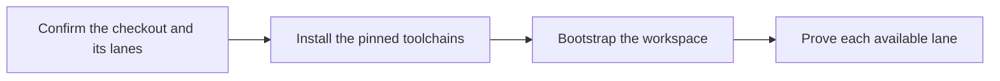

# PTLam Health Connector Setup

Prepare one Health Connector checkout for Dart, Android, and (on macOS) iOS
development. This workflow may install missing local tools only after the user
explicitly asked for setup and approved downloads outside the checkout.

## How does a clone become a working checkout?



## 1. Confirm the checkout and its lanes

1. Confirm the repository root holds `pubspec.yaml` with
   `name: health_connector_workspace`, `.fvmrc`, `.sdkmanrc`, and
   `.ruby-version`. Stop before touching any other checkout.
2. Read those three pin files and the root `pubspec.yaml`; never copy versions
   from this skill. Record whether the machine supports Dart only, Dart and
   Android, or all three lanes. iOS needs macOS and Xcode.
3. Run `git status` and leave existing work alone. Setup output such as `.fvm/`,
   `.dart_tool/`, and build folders stays uncommitted.

Done when the root is confirmed, the pins are read, and the lanes are known.

## 2. Install the pinned toolchains

Use an existing tool manager when present. Ask before downloading a missing
manager or changing user-level global packages.

| Lane             | Checks                                                                                | Configuration owner                       |
| ---------------- | ------------------------------------------------------------------------------------- | ----------------------------------------- |
| Dart and Flutter | `fvm --version`, `fvm flutter --version`                                              | `.fvmrc`                                  |
| Workspace        | `melos --version`                                                                     | `dev_dependencies` in root `pubspec.yaml` |
| Android          | `java -version`                                                                       | `.sdkmanrc`                               |
| iOS              | `xcodebuild -version`, `ruby --version`, `swiftlint version`, `swiftformat --version` | Xcode plus `.ruby-version`                |
| Documentation    | `node --version`, `npm --version`                                                     | `package.json` and its lockfile           |

Install and activate the project Flutter SDK:

```bash
fvm install
fvm use
fvm flutter --version
```

If Melos is missing after Flutter is active, install it with the pinned Dart
toolchain and verify it:

```bash
fvm dart pub global activate melos
melos --version
```

For Android, install and activate the `.sdkmanrc` candidate with SDKMAN:

```bash
sdk env install
sdk env
java -version
```

For iOS, activate the Ruby version through the machine's rbenv or RVM. Install
SwiftLint and SwiftFormat through the machine's package manager, then verify
both versions. Never claim the iOS lane on a non-macOS host.

Done when every requested lane's checks print the pinned versions.

## 3. Bootstrap the workspace

From the repository root:

```bash
melos bootstrap
```

Done when Melos links every workspace package without adding
`dependency_overrides` to member packages. For documentation work, also run
`npm ci` to install the exact VitePress dependencies from `package-lock.json`.

## 4. Prove each available lane

Run the strongest lane the machine supports:

```bash
melos run format:dart:check
melos run analyze:dart:strict
melos run test:dart
melos run format:kotlin:check
melos run analyze:kotlin
melos run test:kotlin
melos run format:swift:check
melos run analyze:swift
```

Skip Kotlin only when Android is outside the requested setup. Skip Swift only
when the host cannot run it. Report each skipped lane and its missing
prerequisite.

Finish when bootstrap succeeds, every requested available lane passes,
`git status` shows no unexpected tracked change, and the handoff names versions,
commands, failures, and unsupported lanes.
