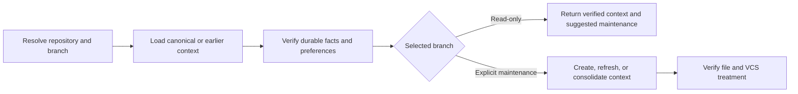

# PTLam Managing Git Context

Resolve or maintain one repository's project-local `CONTEXT.md` containing
durable Git facts and preferences. Read-only and maintenance branches evaluate
the same context artifact against current repository evidence.

## At a glance



## Context contract

| Concern | Boundary |
| --- | --- |
| Primary artifact | `<repository-root>/.ptlam-agent-plugin/skills/engineering/ptlam-managing-git-context/CONTEXT.md` |
| Read-only trigger | Another Git workflow needs verified repository facts or preferences |
| Maintenance trigger | The user explicitly asks to create, refresh, review, or consolidate Git context |
| Authority | Context maintenance changes only canonical context and explicitly authorized replaced context files; it never grants staging, commit, push, publication, or other Git authority |
| Acceptance | Every returned or stored entry is durable, current, scoped, and supported by live repository evidence |

## 1. Resolve the repository and branch

1. Resolve the repository root from the explicit task path and repository
   evidence. Keep nested repositories, submodules, worktrees, and multiple
   repositories separate.
2. In a linked worktree, use only the context visible from that worktree. Do not
   search another worktree for local context.
3. Select read-only mode unless the user explicitly requests context
   maintenance.
4. Ask which repository owns the context only when several roots remain
   plausible and the choice changes the stored scope.

Complete this step when every repository has one root and the context operation
is explicitly read-only or writable.

## 2. Load canonical or earlier context

Use this canonical path:

```text
<repository-root>/.ptlam-agent-plugin/skills/engineering/ptlam-managing-git-context/CONTEXT.md
```

Load the canonical file when it exists. Treat current user instructions,
repository policy, Git configuration, hooks, hosting configuration, and
collaboration surfaces as the sources of truth. The context is a verified cache,
not authority over live evidence.

When the canonical file is absent, check these earlier layouts in order:

```text
.ptlam-agent-plugin/skills/engineering/ptlam-git/CONTEXT.md
.ptlam-agent-plugin/skills/ptlam-git/profile.md
.ptlam-agent-plugin/skills/engineering/ptlam-git/profile.md
```

Load relevant facts in place and report every earlier file. In maintenance mode,
consolidate only verified current content into the canonical file. Remove a
replaced file only when deletion is explicitly authorized.

Complete this step when current information has one canonical destination and
every retained earlier-layout file is known.

## 3. Keep one durable context artifact

Use compact identity and freshness frontmatter:

```yaml
---
schema_version: 1
skill: ptlam-managing-git-context
canonical_path: skills/engineering/ptlam-managing-git-context
updated_at: YYYY-MM-DD
---
```

Keep three kinds of information inside the file:

### Project profile

Record repository, workspace, submodule, and worktree boundaries; policy,
hooks, checks, and collaboration entrypoints; and evidence or invalidation
signals. Link to authoritative repository sources instead of copying them.

### Git flow

Record stable branch and ref roles, base-selection rules, upstream or push
relationships, review and release practices, and required gates. Record roles
and policies rather than current object IDs, ref positions, queue state, or
operation progress.

### Git preferences

Record durable subject, body, trailer, signing, issue-reference, worktree,
integration, publication, and recovery preferences with their scope and
evidence. Store a preference only when the user states it as durable. Do not
infer one from a single accepted command, commit, or workflow.

Never store permission grants, secrets, transient logs, machine-specific
absolute paths, research notes, alternatives, or task history. Preserve unknown
fields and require an explicit migration before changing an unsupported schema.

Complete this step when every retained item is a durable project fact, Git-flow
fact, or explicitly supported scoped preference.

## 4. Verify freshness and complete the branch

Compare every task-relevant entry with current instructions, configuration,
repository evidence, and shared state. Recheck an entry when its evidence
changes, a recorded command fails, or current policy contradicts it. Treat dates
as freshness signals rather than proof.

### Read-only

Leave every context file unchanged. Return verified entries and report material
new, changed, or stale durable knowledge as suggested maintenance.

### Explicit maintenance

Create the canonical file only after current evidence establishes at least one
durable fact or preference. Update content in place, remove stale entries only
when replacements are verified, and change `updated_at` only when stored content
changes.

Preserve existing VCS treatment. If the file is tracked, update it as ordinary
project state. If ignored, keep it local. If untracked and not ignored, leave it
untracked and report that state. Never edit `.gitignore`, stage, commit, or
publish merely because context changed.

Complete this step when the read-only branch has no file effect or the
maintenance branch has one verified canonical file with preserved VCS
treatment.

## 5. Return the context result

Return the repository root, canonical path, selected branch, file state,
verified task-relevant facts and preferences, stale or provisional entries,
suggested maintenance, retained earlier files, and tracked, ignored, or
untracked status.

Complete the task when another workflow can consume the result without
rediscovering repository context and every file effect stays within the
explicit context authority.
