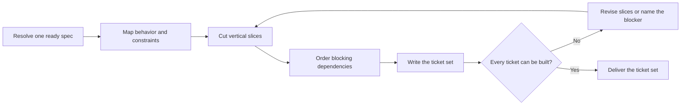

# PTLam Planning Tickets

Turn one ready feature specification into one ordered set of ticket files. Each
ticket is a vertical slice: one observable result through every layer it needs.
The ticket set owns work decomposition and blocking edges. It does not change
feature behavior, invent architecture, or publish to a tracker.

## Required skills

### `ptlam-explaining`

**Reason:** Makes unfamiliar ticket intent and dependencies understandable to implementers without changing the source specification.

**Instructions:** Read and apply ptlam-explaining before drafting the ticket set.
Infer the implementer's difficulty from the ready specification and
project evidence; do not start another interview.
Let it own the literal model, explanatory structure, teaching order,
and reconstruction check.
Use its explanation package inside the ticket set without changing
facts, slices, schema, destination, or readiness owned by this skill.
Enter the analogy branch only when the user explicitly asked for one.

Read [ptlam-explaining](skills/ptlam-explaining/SKILL.md).

### `ptlam-mermaiding`

**Reason:** Makes ticket order and blocking relationships visible as a verified dependency map instead of burying them in prose.

**Instructions:** Read ptlam-mermaiding before choosing the ticket set's visual form.
Apply it to the dependency order and any other material
relationship; use a table for exact mappings.
Let it own the visual question, diagram type, Mermaid source, and the
strongest available syntax and rendering check.
Keep this skill's ownership of ticket facts, vertical slices,
document structure, visual placement, destination, and readiness.
Make each visual replace equivalent prose rather than repeat it.

Read [ptlam-mermaiding](skills/ptlam-mermaiding/SKILL.md).

## How does a ready spec become tickets?

This skill does not interview. It decomposes confirmed spec content and never
starts a second discovery round.

## 1. Resolve the spec and destination

Require one feature spec with status `ready`. Stop when it is draft, blocked,
missing traceability, or contradicts itself. A new product or large epic must
reach the PRD first; a feature inside an existing product starts at the spec; a
small fix skips this pipeline.

Read the applicable `AGENTS.md` files before choosing paths. Use their ticket
location when defined; otherwise use
`<project-root>/docs/specs/<feature>/tickets/`.

Running this skill allows creating that folder, its `README.md`, and numbered
ticket files. It does not allow overwriting existing tickets, changing the spec,
changing code, publishing tracker items, or Git operations.

Done when the source spec, project root, destination, and write permission are
explicit.

## 2. Map the obligations

Read the whole spec and the repository evidence it cites. Build a map from
behavior IDs to contracts, data lifecycles, failure paths, rollout constraints,
and required evidence. Keep deliberate implementation freedom in place.

Read the spec's architecture constraints. Map each deferred concern, with its
signal, and the redesign trigger as work no ticket owns.

Record missing outcome-changing detail as a spec blocker. Do not repair the spec
inside a ticket or turn an assumption into a requirement.

Done when every spec behavior and constraint has one disposition in the map,
every deferred concern is mapped as unowned work, and no ticket has to invent
product behavior.

## 3. Cut vertical slices

Make each ticket deliver one observable path through the layers it needs. A
slice must be reviewable and verifiable on its own, even when another ticket
must land first.

Start with the smallest end-to-end walking path, then extend behavior, failure
handling, data lifecycle, compatibility, and rollout in coherent steps. Avoid
database-only, API-only, UI-only, or test-only tickets with no user- or
operator-visible result. When enabling work cannot be vertical, name its first
consumer and keep it smaller than that consumer.

Slice a migration as expand, then migrate, then contract, following the
code-style evolution rule. Each stage must ship on its own.

Done when every ticket owns one result, every spec behavior is covered once or
deliberately shared, and no slice is only a technical layer.

## 4. Order the dependencies

Give tickets stable IDs in execution order. For each ticket, name its
`Blocked by` and `Blocks` edges with those IDs. An earlier file may not depend
on a later one. Split or reorder any cycle instead of hiding it in prose.

Done when the graph has no cycle, every edge appears at both ends, and the
numbered filenames form a valid build order.

## 5. Write and verify the ticket set

Read [the ticket set schema](references/ticket-set-schema.md). It owns the
overview file, ticket shape, filename rule, and readiness checks.

Check that each acceptance line is observable, each proof obligation comes from
the spec, and the dependency diagram matches the ticket edges. Report the
folder, ticket count, ordered IDs, checks, and blockers.

Finish when every schema check passes and an implementer can take the first
unblocked ticket without reading the chat.
