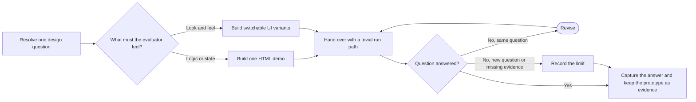

# PTLam Prototyping

Build one runnable, throwaway prototype that answers one design question for a
developer or a non-developer. The question picks the branch: a logic demo or a
set of UI variants on one route.

After evaluation, the prototype is evidence of what the evaluator saw. None of
its code ships. This skill does not build an MVP, a production feature, a
benchmark, or a durable demo.

## Required skills

### `ptlam-git`

**Reason:** Isolates tracked prototype changes and preserves an approved prototype as evidence without disturbing production work.

**Instructions:** Read and apply ptlam-git before a prototype changes a Git repository
or the user asks to capture it on a branch.
Let it own repository and worktree resolution, branch mechanics,
unrelated-state protection, staging, commit construction, and the
Git check.
Keep this skill's ownership of the design question, logic-versus-UI
branch, artifact, handover, answer, and capture intent.
A prototype request allows local artifact files, not a commit, push,
issue change, or branch cleanup; require explicit permission for
those.

Read [ptlam-git](skills/ptlam-git/SKILL.md).

## How does one question choose and finish a prototype?

| Boundary   | Rule                                                                                       |
| ---------- | ------------------------------------------------------------------------------------------ |
| Question   | One design decision and the observation that would answer it                               |
| Logic      | One self-contained HTML file with free play, guided scenarios, and visible state           |
| UI         | Three to five structurally different variants on one route with a visible switcher         |
| Production | The validated decision may transfer; prototype code does not                               |
| Permission | Local prototype files are in scope; commits, pushes, and issue changes need permission     |
| Done       | The evaluator can run it, the answer or missing evidence is recorded, and capture is clear |

## 1. Resolve the question and the branch

1. Read the request, every applicable `AGENTS.md`, and the existing module or
   page. Look at current behavior before changing it.
2. State one question and the decision its answer changes. Ask when an ambiguity
   would pick a different artifact. With no answer, infer from the target: a
   backend module means logic; a page or component means UI. Write that
   assumption inside the prototype.
3. Pick and read exactly one branch:

| Question                                                                   | Branch                       |
| -------------------------------------------------------------------------- | ---------------------------- |
| Does this business logic, state model, data shape, or method surface work? | [Logic](references/logic.md) |
| What should this page, component, layout, or interaction look like?        | [UI](references/ui.md)       |

Then pick a clearly named prototype location near the target, following the
project's conventions. For tracked application changes, first isolate the work
through the loaded Git skill. Define the evidence, the smallest useful scope,
the run path, and every permitted side effect.

Done when the question, branch, destination, evidence, run path, and permission
are explicit.

## 2. Build the artifact

Apply the selected branch, then these shared rules:

1. Make the question and the throwaway status visible in the artifact.
2. Give the evaluator one obvious way to start it: a logic demo opens directly;
   a UI prototype uses one task-runner or local-serve command and one URL.
3. Keep prototype state in memory with representative fake data. Keep existing
   read-only UI data only after settling its access, privacy, evaluator, and
   capture effects. When persistence is the question, use a scratch database or
   file whose name says it is safe to wipe.
4. Build only what makes the question answerable. Skip test suites, general
   abstractions, broad error handling, and unrelated polish.
5. Show the full relevant state after every action or variant switch, without
   making prototype controls look like product UI.

Done when the artifact runs through its promised entry point, the question is
visible, and the evaluator can see what each action changes.

## 3. Hand over, observe, revise

Give the evaluator the file or URL, the command when needed, the scenarios or
variant keys, and the one question to judge. Wait for a human answer when it
depends on feel or preference; never invent it.

Repair a broken artifact and rerun it. Revise freely while feedback still tests
the same question. Stop when the question is answered, the evidence is not
available, or the next change would test a different question.

Done when the answer traces to an observation or the missing evidence is named.

## 4. Capture the answer and keep the evidence

Record the question, answer, deciding observation, accepted choice, and the
remaining limit in the implementation issue, commit, or handoff.

Keep the whole prototype as evidence, not as production code. When Git capture
and external writes are allowed, keep it on a throwaway branch outside the
production branch and point to it from the implementation issue or the handoff.
Leave branch, worktree, staging, and commit mechanics to the loaded Git skill.
Otherwise report the capture that still waits for permission.

The production branch gets a fresh implementation of the validated decision
only. It keeps no demo shell, switcher, losing variant, or shortcut because the
prototype worked.

Finish when the result is recorded, the prototype's fate is explicit, and
production code cannot be mistaken for the throwaway artifact.
