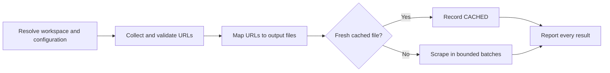

# PTLam Scraping URLs

Batch-scrape HTTP and HTTPS pages into local Markdown files. Accept URLs pasted
in the prompt, a text file of URLs, or both. One failed page never stops the
rest of the queue.

Running this skill allows creating the workspace-local configuration, the output
folder, and the scraped Markdown files. It does not allow Git operations,
publishing, credential changes, or writes outside those paths.

## How does a URL become an accounted local file?



| Concern           | Owner                                                                      |
| ----------------- | -------------------------------------------------------------------------- |
| Saved defaults    | The workspace-local `CONFIG.yml`                                           |
| One-run overrides | The current prompt                                                         |
| Page retrieval    | The best available scraper, then the host's web-fetch tool                 |
| File creation     | This run, limited to the resolved config and output paths                  |
| Done              | Every supplied URL has a reported status, and every successful file exists |

## 1. Resolve the configuration

Read [configuration](references/configuration.md) before resolving any path. It
owns the workspace root, the `CONFIG.yml` location, the three keys, and how a
prompt override wins.

Done when the file exists and all three effective values are valid.

## 2. Collect the URLs

Accept either input form, with no positional arguments:

- **Prompt URLs.** Take the URLs the user clearly marks as scrape inputs. Accept
  absolute `http://` and `https://` URLs in prose, lists, or Markdown links. Do
  not treat a passing citation in the instructions as an input.
- **Input file.** Resolve the user's path from the workspace root unless it is
  absolute. Read one URL per line. Trim whitespace; skip blank lines and lines
  whose first non-space character is `#`.

With both forms, combine them prompt first, then file. Keep every candidate row.
Record an exact duplicate as `SKIPPED` pointing to the first candidate; do not
queue it again.

Stop with the path and the reason when a named input file is missing,
unreadable, or empty after filtering. Record malformed or unsupported candidates
as `SKIPPED`; never guess a URL. Stop when no valid URL remains.

Done when every candidate is one normalized URL or one `SKIPPED` row.

## 3. Map URLs to output files

Resolve `OUTPUT_DIRECTORY` by the configuration rules. Create it before
retrieval; stop with the filesystem error if that fails.

Read [output files](references/output-files.md). It owns filename derivation,
collisions, and the freshness check that decides which URLs still need fetching.

Done when the folder exists, every valid URL maps to one unique path inside it,
and each one is either `CACHED` or queued once.

## 4. Scrape the queue

Read [retrieval](references/retrieval.md). It owns bounded concurrency, the
fallback, completeness classification, safe replacement, and the JSON result per
URL.

Done when every queued URL has one `OK`, `PARTIAL`, or `FAILED` result, and
every `OK` file exists at the reported non-zero size.

## 5. Report the run

Print one row per supplied candidate, in the original order:

```markdown
| #   | URL | Status | File | Size | Detail |
| --- | --- | ------ | ---- | ---- | ------ |
```

Use `OK`, `PARTIAL`, `FAILED`, `CACHED`, or `SKIPPED`. Put a short reason in
`Detail` for partial, failed, and skipped rows; leave it empty otherwise. Then
report totals as
`X succeeded, Y partial, Z failed, C cached, S skipped, N supplied.`

Finish when the table accounts for every candidate, the totals match the rows,
and every `OK` or `CACHED` path and size was verified.
