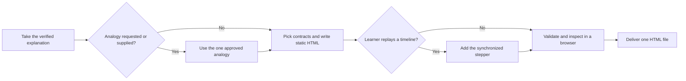

# PTLam Visualizing with HTML

Create or revise one portable HTML explainer that lets a learner see and, when
useful, operate a system. The file uses native HTML, CSS, JavaScript, and inline
SVG. It opens directly, with no framework, build step, CDN, server, sibling
file, or external asset.

This skill builds focused learning pages. App-shell navigation, pickers,
floating actions, menus, dialogs, and sheets belong to an application workflow
instead.

## Required skills

### `ptlam-explaining`

**Reason:** Supplies the verified explanation the page renders, including its optional analogy branch.

**Instructions:** Read and apply ptlam-explaining for every page. Let it own the
learning goal, depth, literal answer, literal model, explanatory
structure, and reconstruction check.
Enter its analogy branch only when the user explicitly asks for an
analogy or supplies one. Let that branch own the candidates, the
user's choice, the mapping, the story, and the caveats. Consume those
outputs without building a second analogy.
Keep this skill's ownership of the portable HTML rendering and the
visual interaction.

Read [ptlam-explaining](skills/ptlam-explaining/SKILL.md).

## How does an explanation become a portable HTML page?



## Read for every page

| Reference                                                                | Owns                                                                  |
| ------------------------------------------------------------------------ | --------------------------------------------------------------------- |
| [design system](references/design-system/design-system.md)               | The token and component system the scaffold emits, and its principles |
| [accessibility](references/design-system/foundations/accessibility.md)   | Contrast, focus, semantics, and assistive-technology behavior         |
| [content design](references/design-system/foundations/content-design.md) | Visible wording, alternative text, and truncation                     |
| [interaction](references/design-system/foundations/interaction.md)       | States, targets, and input handling                                   |
| [layout](references/design-system/foundations/layout.md)                 | Page shell, grid, spacing, and responsive structure                   |

## 1. Take the explanation and resolve the page

Start from the verified explanation package: its Goal, Presentation, Model,
Explanation, and Limits. Do not rebuild or quietly change them here.

Resolve the output path and whether you create or revise. Inspect an existing
page before changing it. Decide whether the page is literal-only, needs a new
analogy, or already carries a user-supplied one.

Done when the destination and change permission are clear, one verified
explanation supplies every literal fact, and the analogy branch is known.

## 2. Resolve the optional analogy

Use an analogy only when the user explicitly asks for one or supplies an already
selected one. Otherwise carry the literal model forward unchanged.

For an analogy, use only the mapping, story, caveats, and alternatives the
explanation approved. Send a material gap back to the explanation instead of
patching it here, and never render a failed mapping as if it were evidence. Then
load the rendering contracts:

| When                                      | Read                                                                                |
| ----------------------------------------- | ----------------------------------------------------------------------------------- |
| Any analogy                               | [analogy mapping](references/design-system/patterns/content/analogy-mapping.md)     |
| Two synchronized maps teach the mechanism | [analogy twin](references/design-system/patterns/analogy-twin/analogy-twin.md)      |
| Lifetime or change cadence is the lesson  | [layered lifetimes](references/design-system/patterns/content/layered-lifetimes.md) |

Done when the page is literal-only or carries one approved analogy.

## 3. Pick contracts and write the static page

Read [visual contract selection](references/visual-contract-selection.md). It
maps each relationship, composition, control, component, and customization
concern to the contract that owns it, and says how many to load.

For a new page, read [scaffolding](references/scaffolding.md) and run its
command. The scaffold, not the references, is the source of the exact tokens,
global CSS, and shell markup. Replace every placeholder. For an existing page,
keep correct content and interaction state while bringing the file into this
contract.

Teach in order: orientation, then mechanism, then deeper views. A learner who
scrolls straight through must never meet a term the page has not introduced.
Keep the primary view before observable state and controls in both DOM order and
narrow-screen order; check the narrow rendering rather than assuming. Keep the
main sequence on the page, never behind tabs. Use disclosure only for supporting
detail such as a caveat, a full table, or an alternate path.

Done when static HTML teaches the whole sequence in order, every material
relationship has one visual grammar, every interactive element has one component
contract, and no placeholder remains.

## 4. Add the state model

Skip this step for a static page.

When the learner must replay or inspect an ordered timeline, follow
[the synchronized state model](references/state-model.md). It owns the step
model, the required controls, and the scripts-disabled fallback. Observable
state without playback stays in the static composition from step 3.

Done when the page is static or its state model passes that file's checks.

## 5. Validate and inspect in a browser

Run the bundled validator from any working directory:

```bash
node --experimental-strip-types \
  "<skill-directory>/scripts/validation/validate-html.ts" <page.html>
```

Fix every error. Then open the page and follow
[rendered inspection](references/rendered-inspection.md). It owns the browser
conditions the page must survive and how to repair a failure.

Done when validation passes and every rendered condition holds.

## 6. Deliver

Return the single `.html` file at the destination. Report what changed and
where, the selected visual grammar, whether the analogy branch ran, the
validator command and result, the browser conditions inspected, and anything
still unverified.

Finish when the file opens directly, teaches the lesson with no external
resource, and the handoff separates static checks from browser evidence.
