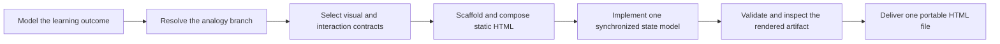

# PTLam Visualization with HTML

Create or revise one portable HTML explainer that lets a learner see and, when
useful, manipulate a system. The artifact uses native HTML, CSS, JavaScript, and
inline SVG and opens directly without a framework, build step, CDN, web server,
sibling file, or external runtime asset.

## Required skills

### `ptlam-explaining-with-analogy`

**Reason:** Owns analogy selection and explanation semantics before HTML rendering.

**Instructions:** Apply ptlam-explaining-with-analogy only when the user explicitly asks
to create an analogy and has not already supplied or chosen one.
Let it own the literal model, candidates, user choice, stable mapping,
story, and caveats. Resume this visualization skill after the choice
and let it own only the portable HTML rendering and visual interaction.

Read [ptlam-explaining-with-analogy](skills/ptlam-explaining-with-analogy/SKILL.md).

## At a glance



## Artifact boundary

For every artifact, read the
[portable artifact contract](references/portable-artifact-contract.md). It owns
the required file boundary, document semantics, accessibility baseline,
progressive enhancement, interaction behavior, and verification conditions.

Read the [design-system baseline](references/design-system/design-system.md),
[accessibility](references/design-system/foundations/accessibility.md),
[interaction](references/design-system/foundations/interaction.md),
[layout](references/design-system/foundations/layout.md),
[usability](references/design-system/foundations/usability.md), and
[document shell](references/design-system/patterns/layouts/document-shell.md)
for every artifact. The scaffold owns exact baseline tokens, global CSS, and
shell markup; these references own how to preserve and extend that baseline.

## 1. Model the learning outcome

Identify the learner's question, background, confusing mechanism, requested
depth, language, output path, and whether the task creates or revises an
artifact. Inspect an existing artifact before changing it.

Model the smallest complete literal system that answers the question. Include
only material actors, boundaries, relationships, order, state, transitions,
ownership, cardinality, and failure behavior. Verify uncertain facts when the
risk requires it; do not fill gaps with plausible detail.

Complete this step when destination and authority are clear and the literal
model contains every fact the artifact must teach.

## 2. Resolve the analogy branch

Use an analogy only when the user explicitly requests one or supplies an
already selected analogy model.

When the user requests a new analogy, apply the required
`ptlam-explaining-with-analogy` skill first. Let it own the literal-to-everyday
mapping, candidates, user choice, story, and caveats. Resume this workflow after
one analogy passes its mapping gate; this skill owns only HTML rendering.

For a selected analogy, read
[analogy mapping](references/design-system/patterns/content/analogy-mapping.md).
When two synchronized maps teach the mechanism, also read the
[analogy-twin pattern](references/design-system/patterns/analogy-twin/analogy-twin.md).
When lifetime or change cadence is the lesson, read
[layered lifetimes](references/design-system/patterns/content/layered-lifetimes.md).

Complete this step when the artifact is literal-only or has one approved,
structurally faithful analogy with a visible boundary.

## 3. Select the visual and interaction contracts

Read [visual contract selection](references/visual-contract-selection.md). It
maps each relationship, composition, control, component, and customization
concern to the detailed contract that owns its implementation.

Choose the smallest visual grammar that exposes the important relationship.
Load only the contracts selected by the artifact's actual content and controls.
Use one visual grammar per relationship, and give every selected contract a
concrete consumer.

This skill excludes app-shell navigation, pickers, floating actions, menus,
dialogs, and sheets. Use a general application or site workflow when those
surfaces, rather than a focused learning artifact, are the product.

Complete this step when every material relationship has one visual grammar,
every interactive element has one component contract, and no selected reference
is unused.

## 4. Scaffold and compose the document

For a new artifact, resolve `<skill-directory>` to the directory containing this
`SKILL.md`, use Node.js 22.6 or newer, and run from any working directory:

```bash
node --experimental-strip-types \
  "<skill-directory>/scripts/scaffolding/scaffold-html.ts" \
  output.html --title "How the system works"
```

The scaffold is the canonical source for baseline tokens, global CSS, and shell
markup. Replace every instructional placeholder. For an existing artifact,
preserve correct content and interaction state while bringing the file into the
same contract.

Compose a top-to-bottom learning sequence: orientation before mechanism, then
progressively deeper views. Keep the primary view before observable state and
shared controls in both DOM and narrow-screen order. Keep the main sequence
visible rather than hiding it behind tabs.

Complete this step when static HTML teaches the whole sequence, selected
components use their required anatomy, and no instructional placeholder remains.

## 5. Implement one synchronized state model

When time or state is part of the lesson, drive active nodes, active edges,
observable values, captions, counters, and paired analogy/literal views from one
step model. Provide Back, Next, Play/Pause, and Reset. Never auto-play.

Back restores the exact previous state. Reset restores step 1. Play stops at the
end and can replay. Preserve the current step across viewport changes and stop
playback while the document is hidden.

Use inline classic or module scripts according to scoping needs; import no
runtime dependency. Put a useful default state in the HTML and a complete
ordered fallback for every step so JavaScript enhances rather than owns the
explanation.

Complete this step when every control causes one deterministic transition and
the scripts-disabled document still explains every step.

## 6. Validate and inspect the rendered artifact

Run the bundled static validator from any working directory:

```bash
node --experimental-strip-types \
  "<skill-directory>/scripts/validation/validate-html.ts" <artifact.html>
```

Fix every error. Then inspect the real document at narrow and wide widths,
keyboard-only, reduced motion, scripts disabled, 320 px viewport width, and 200%
text zoom. Exercise every interactive step and semantic-zoom level.

Static validation cannot detect rendered overflow. Reflow an offending grid,
flex child, label, SVG, code block, or badge instead of hiding document
overflow.

Complete this step when validation passes and browser inspection shows that
content, focus, controls, diagrams, and state remain visible and usable in every
required condition.

## 7. Deliver and hand off

Return the single `.html` file at the resolved destination. Report what changed
and where, the selected visual grammar, whether the analogy branch ran, the
validator command and result, browser conditions inspected, and any behavior
that remains unverified.

Complete the task when the file opens directly, teaches the lesson without
external runtime resources, and the handoff distinguishes static checks from
rendered browser evidence.
